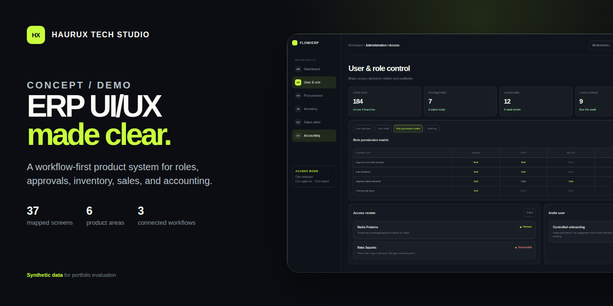
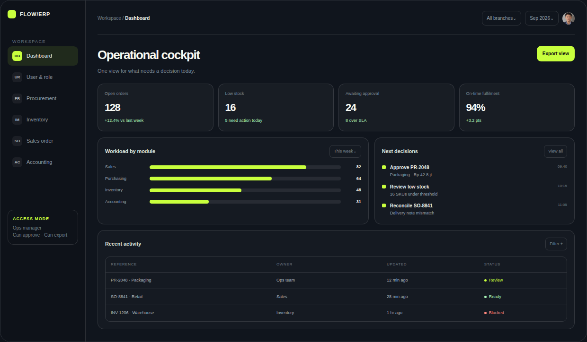
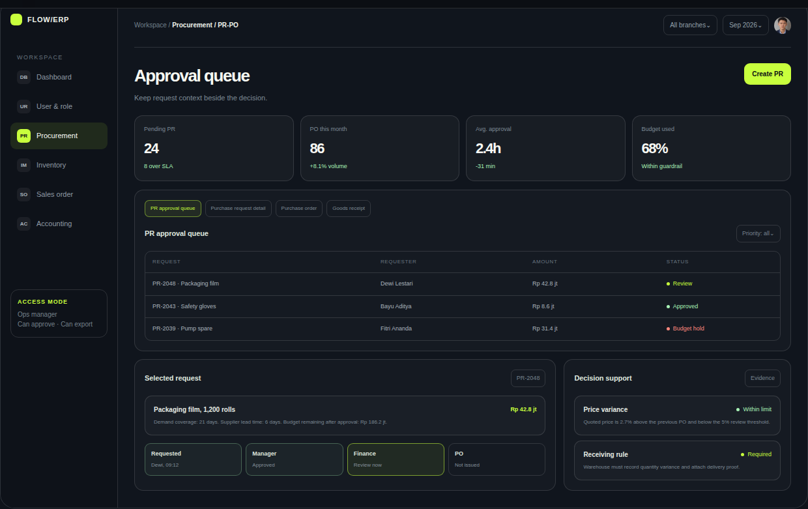
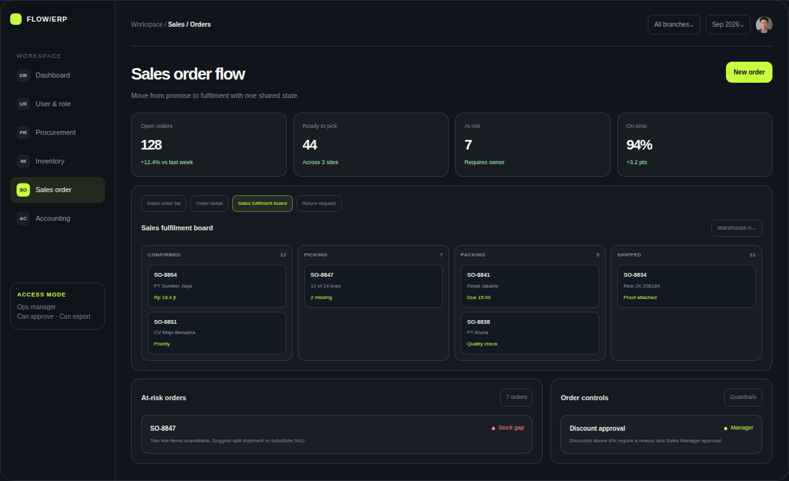
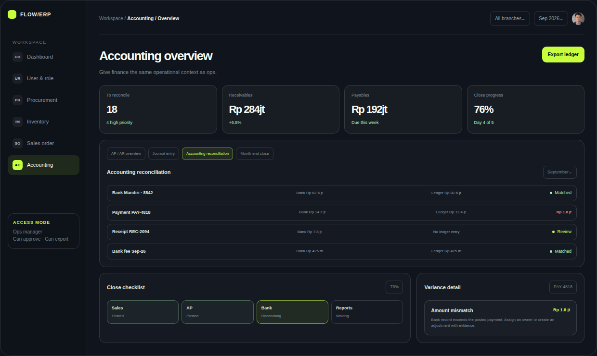
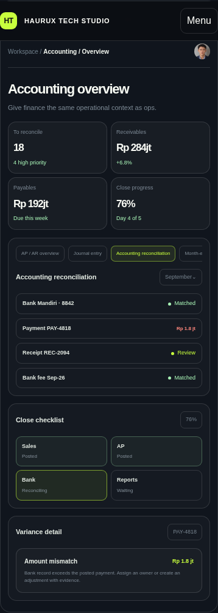

# HAURUX TECH STUDIO

## ERP UI/UX Concept Portfolio


**Concept / Demo** | Responsive web ERP | 37-screen information architecture | Three connected workflows



This evidence-first case study explores how a complex ERP can make roles, approvals, operational risk, and cross-module handoffs easier to understand. It combines a working front-end prototype, a proposed 37-screen scope map, real interface captures, and a downloadable portfolio.

[**Live Demo**](https://18228077326z-droid.github.io/haurux-erp-portfolio/) | [**Download PDF**](https://18228077326z-droid.github.io/haurux-erp-portfolio/assets/HAURUX_ERP_UIUX_Portfolio.pdf) | [**Read the Case Study**](CASE_STUDY.md)

> This is a tailored Concept / Demo created from a limited public brief. It uses synthetic data and does not represent a launched client system, a production deployment, or measured business results.

## The design challenge

ERP work rarely stays inside one page. A request becomes an approval, a purchase order becomes a receipt, a sales promise becomes a warehouse task, and a physical movement becomes a financial record. The interface must preserve context across those changes without overwhelming each role.

The concept focuses on six reviewable product surfaces:

- **Dashboard:** turns operational signals into a prioritized decision queue.
- **User & Role:** makes access, role assignment, and review states visible.
- **PR / PO:** keeps request context beside approvals, purchasing, and receiving.
- **Inventory:** connects stock risk, movement history, and replenishment action.
- **Sales:** gives Sales and Warehouse one shared fulfilment state.
- **Accounting:** links reconciliation exceptions to their source records.



## 37-screen scope map

The information architecture treats a screen as a distinct job-focused route or workspace. Drawers, modals, filters, and interface states are reusable variants rather than extra screens.

| Area | Screens | Coverage |
| --- | ---: | --- |
| Foundation & Navigation | 5 | Sign in, profile, search, notifications, audit activity |
| User & Access | 5 | Directory, user setup, user detail, roles, access review |
| Sales | 8 | Dashboard, customers, quotations, orders, fulfilment |
| PR / PO | 8 | Requests, approvals, RFQ, vendor comparison, orders, receiving |
| IMS / Inventory | 6 | Overview, item master, stock card, warehouses, transfer, count |
| Accounting | 5 | Dashboard, payables, receivables, journals, reconciliation |
| **Total** | **37** | A proposed baseline to validate during discovery |

The map shows scope and relationships. It is not a claim that 37 production-ready screens have already been delivered. The interactive prototype samples the highest-value patterns so the system direction can be reviewed before expansion.

## Three connected workflows

1. **Purchase control:** Purchase Request -> Approval -> RFQ and comparison -> Purchase Order -> Goods Receipt -> Stock and matching.
2. **Sales fulfilment:** Sales Order -> Pick -> Pack -> Ship, with shared ownership, risk, and proof states.
3. **Inventory action:** Low-stock Alert -> Demand and lead-time Review -> Reorder decision -> ETA and Receipt tracking.

The flows keep the next decision, responsible role, source record, and exception visible at each handoff.

## Interface evidence

| Role-aware access | Purchase approval |
| --- | --- |
|  |  |
| Effective permissions and time-bound access reviews | Request context, approval progress, and variance evidence |

| Inventory control | Sales fulfilment |
| --- | --- |
|  |  |
| Stock movement, demand context, and suggested action | Shared order status from confirmation through shipment |

| Accounting reconciliation | Mobile prioritization |
| --- | --- |
|  |  |
| Source-linked matches and visible variance | Priority information reflowed for a narrow viewport |

## Design decisions

- **Decision-first dashboards:** show what needs attention, why it matters, and who owns the next action.
- **Role-aware access:** separate view, process, approve, and manage permissions instead of relying on page access alone.
- **Context beside the action:** place amount, policy, history, variance, and source documents near approval controls.
- **Dense but readable data:** use stable table patterns, strong hierarchy, progressive disclosure, and consistent numeric treatment.
- **Traceable handoffs:** retain document references and state changes as work moves across modules.
- **Explicit interface states:** define useful empty, loading, error, and read-only behavior, including recovery guidance.
- **Responsive prioritization:** reflow decision content for smaller screens instead of compressing desktop tables.

The prototype also includes visible keyboard focus, a skip link, semantic controls, text labels alongside status colors, live-region updates, and reduced-motion support. These are implemented considerations, not a claim of formal accessibility certification.

## Run locally

The portfolio is a static HTML, CSS, and JavaScript project with no application server or database dependency.

```bash
git clone https://github.com/18228077326z-droid/haurux-erp-portfolio.git
cd haurux-erp-portfolio
export PORT=8765
python3 -m http.server "$PORT" --bind 0.0.0.0
```

Open `http://localhost:8765/`.

## Verify the repository

Run the complete contract suite:

```bash
python3 -m unittest discover -s tests -v
```

The contracts check the managed static product, core ERP content, interaction hooks, public documentation, image evidence, share metadata, and GitHub Pages publishing files.

## Repository guide

| Path | Purpose |
| --- | --- |
| `index.html` | Interactive portfolio and ERP prototype |
| `portfolio-print.html` | Print-layout source for the PDF portfolio |
| `assets/HAURUX_ERP_UIUX_Portfolio.pdf` | Downloadable portfolio |
| `docs/images/` | Real desktop and mobile captures from the prototype |
| `CASE_STUDY.md` | Detailed design rationale, flows, states, and limits |
| `tests/` | Executable content and publishing contracts |
| `.nojekyll` | Keeps the static portfolio unprocessed during GitHub Pages publishing |
| `app.toml` | Declares the managed local product and its health endpoint |

## Integrity and rights

All company names, people, records, values, and performance figures shown in the ERP interface are synthetic data. The work demonstrates a design approach and front-end execution. Final roles, rules, fields, integrations, and production UI would require stakeholder discovery and validation.

Source code is available under the MIT License. The portrait, screenshots, PDF, written case-study content, and visual design remain All Rights Reserved. See [LICENSE.md](LICENSE.md) for the exact boundary.

## Contact

For ERP, operations, or other complex product-system design work, contact **HAURUX TECH STUDIO** at [18228077326zzh@gmail.com](mailto:18228077326zzh@gmail.com).
